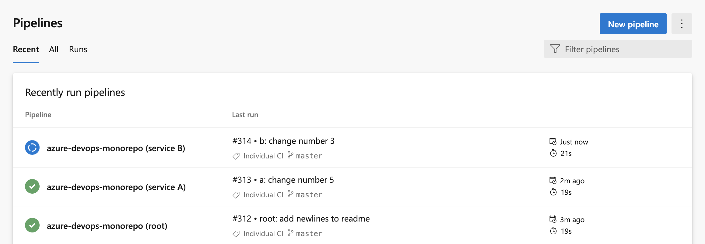
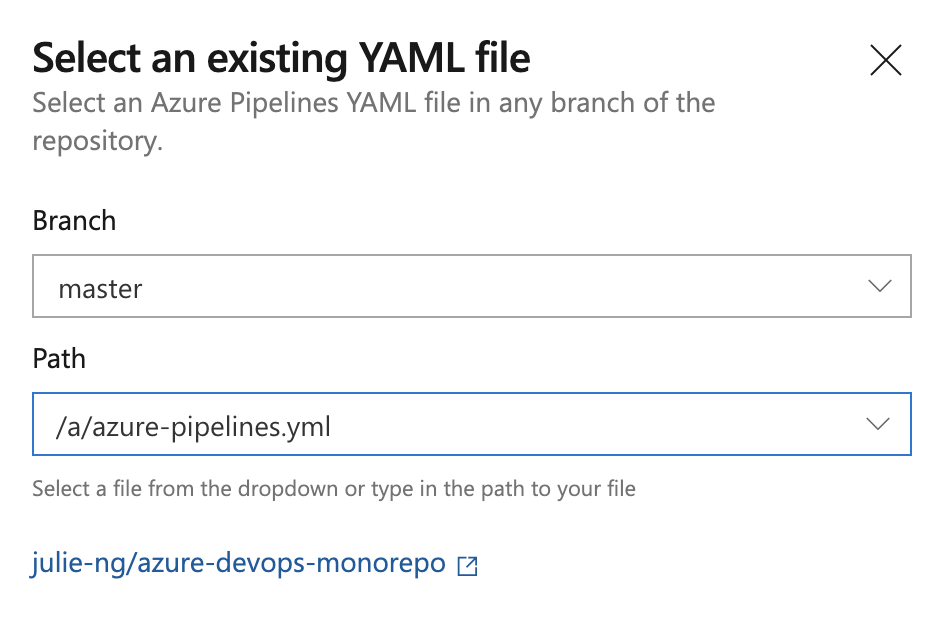
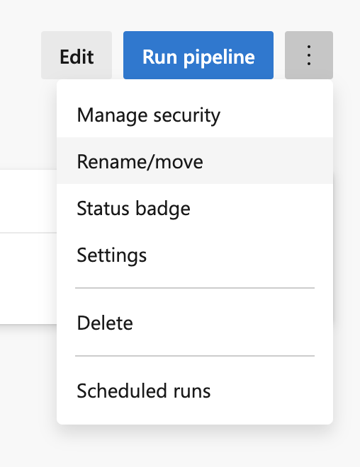

# azure-devops-monorepo

[?branchName=master)](https://dev.azure.com/julie-msft/Public%20Demos/_build/latest?definitionId=9&branchName=master)

## Use Case

This is not a recommendation to use a monorepo, just an example of how to implement it. Although uncommon, there are valid reasons to have a monorepo, especially for projects just migrating to the cloud.

In this scenario, we want to have multiple independent Azure DevOps pipelines in a single git repository.



## Monorepo Structure

This project has 3 different YAML pipelines, one in the project root and two in subfolders as shown:

```
.
├── README.md
├── azure-pipelines.yml
├── service-a
|── azure-pipelines-a.yml
│   └── …
└── service-b
		|── azure-pipelines-b.yml
		└── …
```

## Steps Required in Azure DevOps UI

In short, the trick is that you name your pipeline as code YAML file whatever you want - which was not true when Azure DevOps was first released. Given that, we create three different pipelines.

### Fork the Repository (optional)

This is a public repository so you should be able to add this repository into your Azure DevOps account. Note: you may need to create a service connection to GitHub even though this is a public repository. 

If you have issues, fork the repo.

### Add the Pipeline

1. Go to a project
2. click **"New Pipeline"** blue button
3. Select the repository
4. Under **"Configure your Pipeline"**, select **"Existing Azure Pipelines YAML file"**. Run these steps 1-4 **three times**, each time selecting a different YAML file:
	- `azure-pipelines.yml`
	- `service-a/azure-pipelines-a.yml`
	- `service-b/azure-pipelines-b.yml`

	

### Rename your pipelines

The default names Azure DevOps are not great:

- julie-ng.azure-devops-monorepo
- julie-ng.azure-devops-monorepo (1)
- julie-ng.azure-devops-monorepo (2)

I've renamed mine to

- azure-devops-monorepo (root)
- azure-devops-monorepo (Service A)
- azure-devops-monorepo (Service B)

You can rename the pipeline by clicking on the "3 dots" more options button and selecting **"Rename/move"**. This button can be found at multiple places.



Then you will have the setup in the first screenshot above.

## How It Works

### Root Pipeline

The pipeline in the root folder is defined to ignore changes in the subfolders:

```
trigger:
  paths:
    exclude: # Exclude!
      - 'service-a/*'
      - 'service-b/*'
```

### Sub-project Pipelines

Each subfolder has a pipeline that is (CI) triggered by changes in its own directories. 

```
trigger:
  paths:
    include: # Include!
      - 'service-a/*' # or 'service-b/*'
```

Note: the paths are always defined relative to the project root, not the location of the file.

## Caveats!

There's a reason why monorepos are not common. If you choose this setup, be aware:

- Be Aware of Other Triggers, not just CI ones
- Are we Building A or B or both?
- Keep your Working Directory in Mind, e.g. running `npm install` doesn't work from root. So you may need to set `workingDirectory` in _each_ step.

For details, see my blog article [Creating Monorepo Pipelines in Azure DevOps](https://julie.io/writing/monorepo-pipelines-in-azure-devops/).